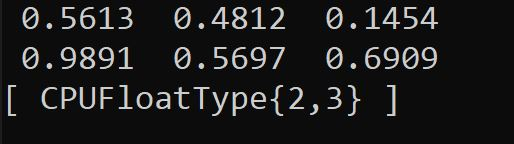

# laod_pytorch_cpp

The example shows how to import PyTorch in C++

## Download the PyTorch

You can find the the pkg from the [link](https://pytorch.org/get-started/locally/).

## How to run PyTorch

```bash
mkdir build
cd build
cmake ..
cmake --build . --config Release
```

Hint: If you use windows
*First*: Add MSBuild from Visual Studio to the Windows path.
*Second*: MSBuild build/load-pytorch.sln

*The following image shows the running PyTorch:*


